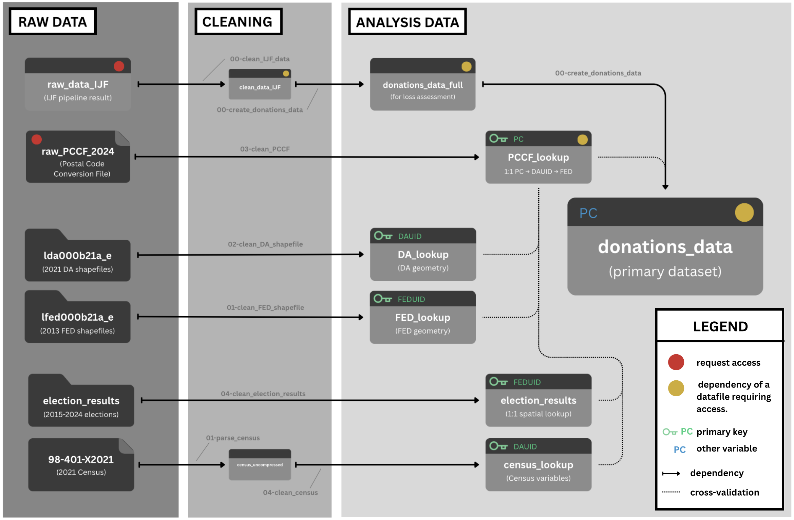

# Characterizing Canadian Out-of-district Political Donations from 2015 to 2024

## Abstract

Federal political representation in Canada is geographical: one Member of Parliament (MP) represents one electoral district. Despite this, Canadians can legally donate to a host of political entities, regardless of proximity. Using Elections Canada's Open Data on Contributions matched with census data from Statistics Canada, we characterize broad patterns in Canadian out-of-district donation from 2015 to 2024. We find that out-of-district donations form a persistent share of donor-sourced funding to both candidates and district associations, averaging 40% across time, election periods, and party lines. While relatively constant through time, their propensity varies substantially across districts, beyond what spatial proximity alone would predict. Districts with higher population density, median household income, educational attainment, and visible minority proportions see higher rates of out-of-district giving, the same traits that predict donor prevalence generally. Still, donor-sourced local campaign funding remains largely regionalized; nearly half of donations that leave their district are received by a political entity in a neighbouring one, and few cross provincial lines. These and other findings may inform further research into the geography of local campaign finance, in Canada and other Westminster-style parliamentary democracies.

## Acknowledgements

Code and data are available at: https://zenodo.org/records/21781460. We thank Natural Sciences and Engineering Research Council of Canada (NSERC) Alliance Grant (ALLRP 599949 - 24) and Social Sciences and Humanities Research Council (SSHRC) Partnership Grant (895-2025-1002) for financial support. We thank Chris Cochrane for suggesting this area of research, and Martin Allen with his help procuring our dataset. We also thank Ellie Murray, Inessa De Angelis, Mariana Garcia Mejia, Oscar Heath, Sabrina Kreyzerman, and Zane Schwartz for their helpful comments. The primary author (Benedict Cummins-Mburu) completed this project during the summer of 2026, while interning at the Investigative Journalism Foundation.

## File Structure

The repository is structured as follows:

-   `data`:
            - `raw_data`: datasets as they were downloaded from their respective sources.
            - `processed_data`: intermediary pipeline datasets.
            - `analysis_data`: primary datasets used for analysis.  
            - `cached_data`: specialized datasets (mainly pre-rendered intermediates to save on compute).

-   `paper`: files used to generate the paper, including the Quarto document, the bibliography (.bib) file, and the renderted PDF of the paper.

-   `scripts`:
            - `processing`: R scripts used to create the intermediary datasets in `data/processed_data/`
            - `cleaning`: R scripts used to clean and validate raw or pre-processed datasets.
            - `other`: R scripts used to carry out supplimentary analyses or to generate compute-heavy visualizations.

All files under `paper` and `scripts` are available in this repository. However, many of the necessary files under `data` were too large to be shared on GitHub (although the folder structure is complete). See below for instructions on how to access/request these datasets.

*Visualization of the project's data pipeline. Files (arrows) displayed represent all datasets (scripts) necessary to reproduce our work. Red-dotted files and their yellow-dotted dependencies are accessible upon request, following the steps outlined in the README. All other files are directly accessible on [Zenodo](https://zenodo.org/records/21781460).*

## Data Acquisition & Reproducibility

> [!NOTE]
> If the reader is only interested in accessing our analysis-ready dataset of geolocated political donations to all federal political entities from 2015 to 2024, scripts 4. and 5. below don't need to be run, saving roughly 10 minutes. This file is called `donations_data_full.parquet` and lives in `data/analysis_data/`.

The majority of our data is openly accessible on [Zenodo](https://zenodo.org/records/21781460). If accessing this repository through GitHub, we suggest replacing the `data` folder from this repository with the `data` folder there. The Zenodo repository takes up roughly 3.6 GB of space, and when the scripts below are run, the full repository takes up roughly 6.3 GB of space. Optionally, the following raw files may be deleted immedately after download to save space, as they are not strictly necessary to reproduce the analysis (rendered redundant by their cleaned versions):

- `data/raw_data/98-401-X2021.zip` (full 2021 Census; 2.25 GB)
- `data/raw_data/lfed000b21a_e` (raw electoral district shapefiles; 0.4 GB)
- `data/raw_data/lda000b21a_e` (raw dissemination area shapefiles; 0.4 GB)

The source for our primary dataset, named `raw_data_IJF.csv`, is available upon request from the Investigative Journalism Foundation (contact at info@theijf.org). Once obtained, this file should be placed in `data/raw_data/`. In addition, the 2024 Postal Code Conversion File must be requested either directly from Canada Post or through your Research Institution. For instance, we accessed this file [here](https://borealisdata.ca/dataset.xhtml?persistentId=doi:10.5683/SP3/OHYOJV). This file should be renamed to `raw_PCCF_2024.tab`, and also placed in the `data/raw_data/` folder of this repository. Please note the TAB filteype.

>[!IMPORTANT]
>For both the Zenodo datasets and the dataset acquired from the IJF, make sure you do not rename any of the filenames, as this will break the pipeline.

>[!IMPORTANT]
>This project uses `renv` to manage R package dependencies. Before running anything, open the repository from its root directory (so that `.Rprofile` is sourced) and run `renv::restore()` to install the package versions recorded in `renv.lock`.

Once the above two files have been added to `data/raw_data/`, run the following scripts already present in this repo, in order, to recover the remaining data necessary for our analysis:

1. `scripts/cleaning/02-clean_PCCF.R`
2. `scripts/processing/00-clean_IJF_data.R`
3. `scripts/cleaning/05-create_donations_data.R`
4. `scripts/other/00-FED_network_extra.R`
5. `scripts/other/01-distance_simulation.R`

These scripts should have created the following datasets:

- `data/processed_data/clean_data_IJF.parquet`
- `data/analysis_data/PCCF_lookup.parquet`
- `data/analysis_data/donations_data_full.parquet`
- `data/analysis_data/donations_data.parquet`
- `data/cached_data/distance_hyp_test_results.parquet`
- `data/cached_data/localized_donations_data_distances.parquet`
- `data/cached_data/localized_donations_data_neighbours.parquet`

Once these additional datasets have been added, `paper.qmd` may be run (the file with most of our analyses), as well as any other script present in the repository, and all of our results will be reproduced.
