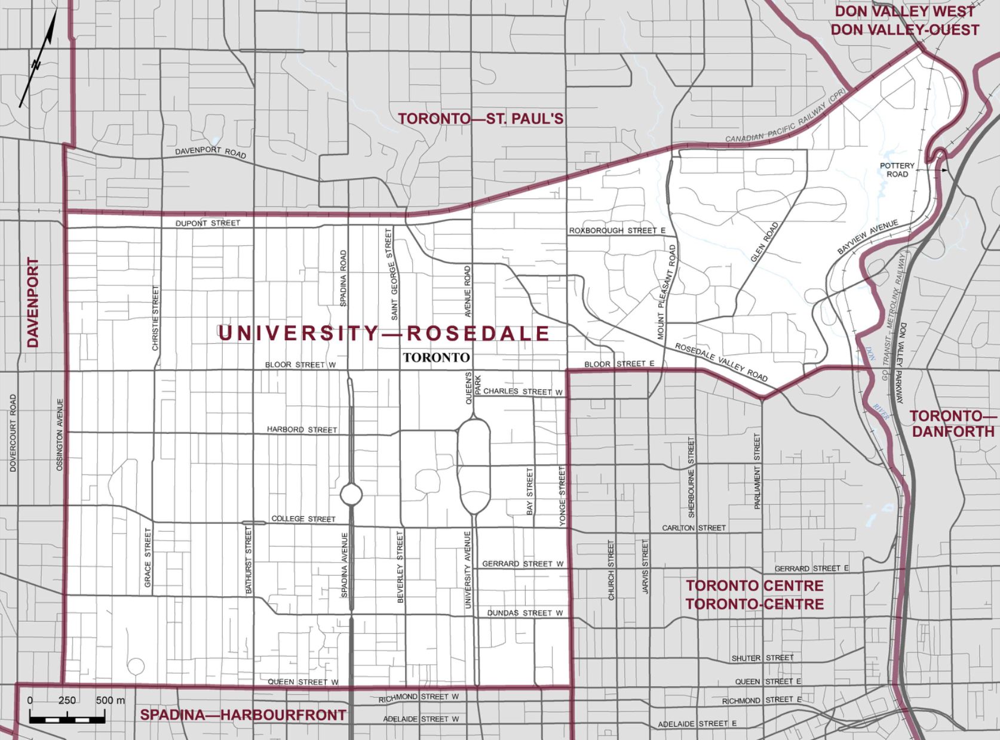
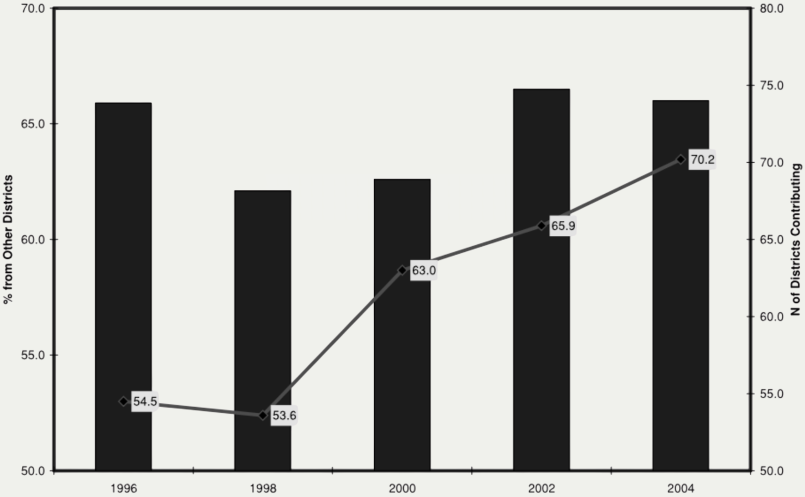
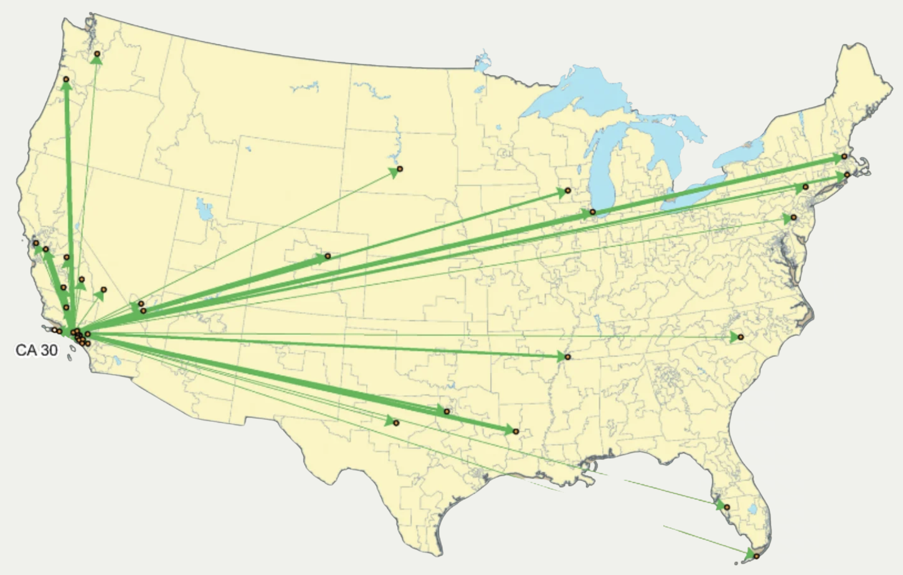
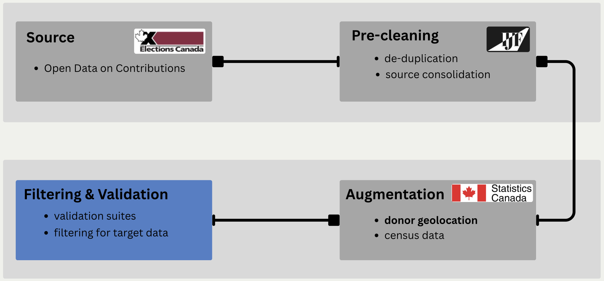
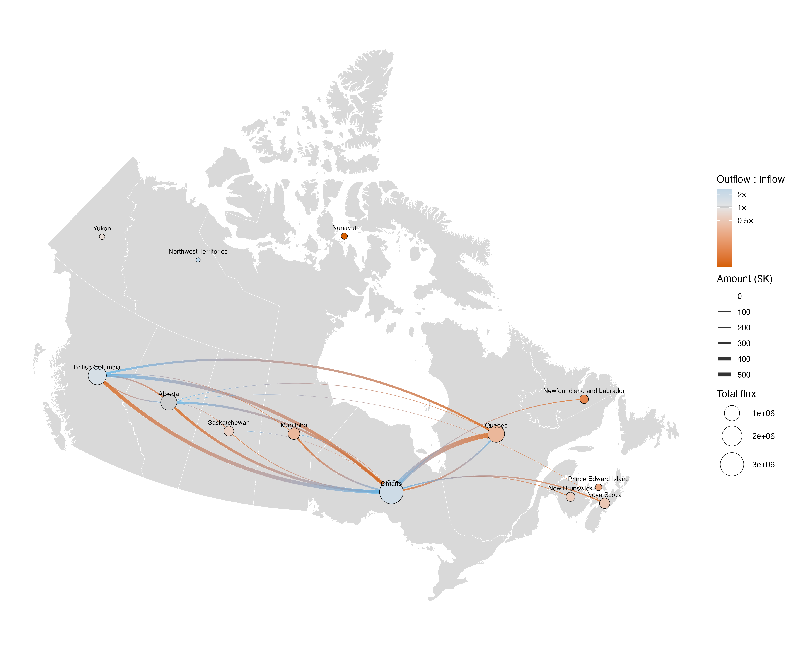
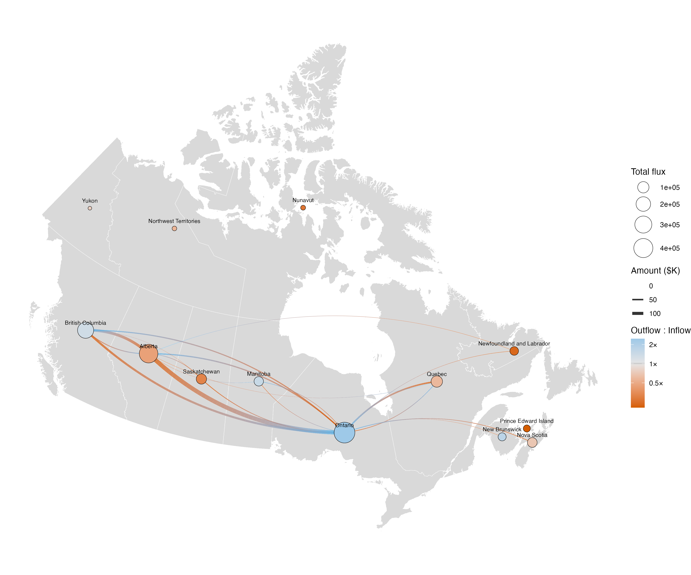

```{r}
#| include: false
#| warning: false
#| message: false

# Load in Supplementary R Script
source(here::here("other/presentation_utsc/presentation_helpers.R"))
#    - localized_donations_data
#    - ELECTION_PERIODS
#    - EFFECT_COLOURS
#    - coef_whisker_plot()
#    - individual_model_data
#    - FED_model_data
```

## Donations & Federal Representation

::: {.notes}
... citizens grouped into spatially-defined districts --> vote to elect a single politician to represent them in parliament.
:::

- In many parliamentary democracies, citizens are <span style="color: #4169E1;">represented</span> at the federal level based on **where they live**[^1].

. . .

:::: {.columns}

::: {.column width="40%"}
{width=100% .bordered}
:::

::: {.column width="20%"}
{width=50% fig-align="center"}
:::

::: {.column width="40%"}
{width=70% .bordered}
:::

::::

[^1]: Many sovereign nations model federal representation in this way, including Canada, the United States, the United Kingdom, Australia, and New Zealand.

## Donations & Federal Representation

::: {.notes}
- **Versatile:** unconstrained in space and time; multiple entities [LIST]; subject to limitations.
- **Impactful:** in Canada and the U.S., donations are the primary source of campaign funding, national party financing.
- **LAST:** [DEFINE OOD] --> ... --> and are the primary means of doing so.
:::

- In many parliamentary democracies, citizens are <span style="color: #4169E1;">represented</span> at the federal level based on **where they live**[^2].

- While voting is the most direct form of individual political participation, <span style="color: #4169E1;">political donations</span> are a **versatile** and **impactful** alternative.

. . .

- **<span style="color: #4169E1;">Out-of-district</span> donations enable individuals to extend their political influence beyond their own district**.

[^2]: Many sovereign nations model federal representation in this way, including Canada, the United States, the United Kingdom, Australia, and New Zealand.

## Out-of-district Donations in the U.S.
::: {.notes}
- **START:** American patterns of out-of-district donation are well-documented throughout the 21st century.    
- Rates have increased over the 21st century.
:::

- **Two-thirds** of campaign funding is sourced from out-of-district, largely from a group of so-called <span style="color: #4169E1;">donor districts</span>.

{width=55% fig-align="center"}

## Out-of-district Donations in the U.S.
::: {.notes}
- **donor districts**: a small set of districts situated in older, wealthier, white, well-educated, and affluent regions of America.
- Donor bases are the same regardless of the party of the receiving political entity. 
:::

- **Two-thirds** of campaign funding is sourced from out-of-district, largely from a group of so-called <span style="color: #4169E1;">donor districts</span>.

{width=55% fig-align="center"}

## Out-of-district Donations in the U.S.
::: {.notes}
- **SECOND**: what this tells us about donor motivations.
- **END THIRD:** ... as representatives become influenced by their national donor base.
:::

- **Two-thirds** of campaign funding is sourced from out-of-district, largely from a group of so-called <span style="color: #4169E1;">donor districts</span>.

- Studies suggest that many of these donors are motivated by **partisan gain**[^3].

. . .

- Out-of-district donations **distort the relationship** between a representative and their constituents[^4].

[^3]: [@gimpel_check_2008]
[^4]: [@baker_getting_2016; @canes_wrone_out_2022; @nathan_donor_2025]

## Our Research Process {.center}

::: {.notes}
In our study, we...
:::

. . .

1. **Document** the extent of out-of-district donation to **Canadian** federal political entities.

. . .

2. **Identify** characteristics of donations associated with their chances of being sent out-of-district.

. . .

3. **Qualify** features of the network of political funding formed by out-of-district donations.

# Dataset

::: {.notes}
- **START:** I'll start by describing how we obtained our study dataset.
:::

## Open Data on Contributions

- Database of all federal political donations above \$20, maintained by *Elections Canada*.

. . .

::: {.greybox}

- For our purposes, this dataset was restricted to:

    - Donations above \$200
    - Donations sent between October 2015 to April 2024
    - Donations addressed to <span style="color: #4169E1;">candidates</span>[^5] or <span style="color: #4169E1;">district associations</span>
:::

[^5]: Neither donations sent to candidates running during by-elections, or aspiring candidates running during nomination contests were considered, to simplify our analysis.

----

::: {.notes}
- **START:** 4 stages, ...
- END: and are ultimately consolidated into a small relational database.
:::

{.pipeline-full}


# Results

Spatio-temporal trends in out-of-district donations rates.

----

::: {.notes}
- Patterns were similar when specific political parties were considered, with specific proportions in any given case varying from 35% to 58%.
:::

```{r}
#| echo: false
#| warning: false
#| message: false
#| out-width: 80%
#| fig-align: center
#| dev.args:
#|   bg: transparent
#| fig-cap: "**Figure 1**: Proportion of donations (by count and by the share of the total amount) to candidates and district associations sourced from out-of-district, from 2015 to 2024. Rates, as well as the relative comparisons between counts, amounts, candidates, and district associations were similar for specific parties."

plot_data <- tribble(
  ~Stat, ~Type, ~Entity,
  0.38, "Count", "Candidate",
  0.40, "Amount", "Candidate",
  0.44, "Count", "District Association",
  0.48, "Amount", "District Association"
)

plot_data |>
  mutate(Entity = factor(Entity, levels = c("Candidate", "District Association"),
                          labels = c("Candidates", "District Associations"))) |>
  ggplot(aes(x = Entity, y = Stat, fill = Type)) +
  geom_col(position = position_dodge(width = 0.7), width = 0.6) +
  geom_text(aes(label = scales::percent(Stat, accuracy = 1)),
            position = position_dodge(width = 0.7), vjust = -0.5, size = 3.5) +
  scale_fill_manual(values = c("Count" = "black", "Amount" = "#4169E1")) +
  scale_y_continuous(labels = scales::percent, expand = expansion(mult = c(0, 0.15))) +
  labs(x = NULL, y = "Out-of-District Share", fill = NULL) +
  theme_minimal(base_size = 12) +
  theme(
    legend.position = "top",
    legend.text = element_text(size = 9),
    legend.key.size = unit(0.4, "cm"),
    panel.grid.major.x = element_blank(),
    panel.grid.minor = element_blank(),
    axis.text.x = element_text(size = 11),
    plot.background = element_rect(fill = "transparent", color = NA),
    panel.background = element_rect(fill = "transparent", color = NA),
    legend.background = element_rect(fill = "transparent", color = NA),
    legend.key = element_rect(fill = "transparent", color = NA)
  )
```

----

::: {.notes}
- **START:** Unlike the U.S., however, rates were constant over time.
- We note that candidate-bound donations are restricted to the following three election cycles in our study period.
:::

```{r}
#| echo: false
#| warning: false
#| message: false
#| out-width: 80%
#| fig-align: center
#| dev.args:
#|   bg: transparent
#| fig-cap: "**Figure 2**: Share of out-of-district (OOD) donations (blue) to electoral **candidates**, and total amount donated (grey) across the 42nd, 43rd, and 44th general election periods. Relative trends were similar when proportions are displayed."

amount_max <- 12

copy_candidate_ood_data <- tribble(
    ~ Election, ~ ood_prop, ~ amount,
    "42nd",     0.419,      10.383,
    "43rd",     0.391,      5.204,
    "44th",     0.377,      4.296
) |>
    mutate(Election = fct_inorder(Election), amount_scaled = amount / amount_max)

ggplot(copy_candidate_ood_data, aes(x = Election, group = 1)) +
    geom_line(aes(y = amount_scaled, colour = "Total Amount ($ Millions)"), linewidth = 1) +
    geom_line(aes(y = ood_prop, colour = "OOD Share (of Total)"), linewidth = 1) +
    geom_point(aes(y = amount_scaled, colour = "Total Amount ($ Millions)"), size = 5) +
    geom_point(aes(y = ood_prop, colour = "OOD Share (of Total)"), size = 5) +
    scale_x_discrete(name = "General Election Period") +
    scale_y_continuous(
        name = "OOD Share (of Total)", limits = c(0, 1), breaks = seq(0, 1, 0.25),
        labels = scales::label_percent(), expand = expansion(mult = c(0, 0.02)),
        sec.axis = sec_axis(~ . * amount_max, name = "Total Amount ($ Millions)")
    ) +
    scale_colour_manual(name = NULL, values = c("OOD Share (of Total)" = "#4169E1", "Total Amount ($ Millions)" = "grey60")) +
    theme_classic() +
    theme(
        legend.position = "top",
        plot.background = element_rect(fill = "transparent", colour = NA),
        panel.background = element_rect(fill = "transparent", colour = NA),
        legend.background = element_rect(fill = "transparent", colour = NA)
    )
```

----

```{r}
#| echo: false
#| warning: false
#| message: false
#| out-width: 80%
#| fig-align: center
#| dev.args:
#|   bg: transparent
#| fig-cap: "**Figure 3**: Share of out-of-district (OOD) donations (blue) to **district associations**, and total amount donated per quarter (grey) during the study period (2015 to 2024). The OOD share trend was fit using a generalized additive model with a smooth term over donation date, estimated at the individual level; the ribbon represents its 95% confidence interval. Shaded vertical bars indicate the 42nd, 43rd, and 44th general election periods respectively."

eda_data <- localized_donations_data %>% filter(political_entity == "Registered associations")

amount_max <- 10
n_basis_functions <- 10

quarterly_amount <- eda_data %>%
  mutate(quarter = lubridate::floor_date(donation_date, "quarter")) %>%
  group_by(quarter) %>%
  summarise(amount_m = sum(total_amount) / 1e6, .groups = "drop")

ggplot(eda_data, aes(x = donation_date)) +
  geom_rect(
    data = ELECTION_PERIODS, inherit.aes = FALSE,
    aes(xmin = start, xmax = end, ymin = -Inf, ymax = Inf),
    fill = "grey60", alpha = 0.5
  ) +
  geom_line(
    data = quarterly_amount, inherit.aes = FALSE,
    aes(x = quarter, y = amount_m / amount_max, colour = "Quarterly Total ($ Millions)"), linewidth = 0.8
  ) +
  geom_point(
    data = quarterly_amount, inherit.aes = FALSE,
    aes(x = quarter, y = amount_m / amount_max, colour = "Quarterly Total ($ Millions)"), size = 1.5
  ) +
  geom_smooth(
    aes(y = as.numeric(is_out_of_district), colour = "OOD Share (of Total)"),
    method = "gam", formula = y ~ s(x, bs = "cs", k = n_basis_functions),
    method.args = list(family = binomial()), fill = "#4169E1", alpha = 0.25, linewidth = 0.8
  ) +
  scale_x_date(
    name = NULL, date_breaks = "1 year", date_minor_breaks = "1 month",
    date_labels = "%Y", guide = guide_axis(minor.ticks = TRUE)
  ) +
  scale_y_continuous(
    name = "OOD Share (of Total)", limits = c(0, 1), breaks = seq(0, 1, 0.25),
    labels = scales::label_percent(), expand = expansion(mult = c(0, 0.02)),
    sec.axis = sec_axis(~ . * amount_max, name = "Quarterly Total ($ Millions)")
  ) +
  scale_colour_manual(name = NULL, values = c("OOD Share (of Total)" = "#4169E1", "Quarterly Total ($ Millions)" = "grey60")) +
  theme_classic() +
  theme(
    legend.position = "top",
    axis.text = element_text(size = 8),
    axis.minor.ticks.length.x.bottom = rel(0.6),
    plot.background = element_rect(fill = "transparent", colour = NA),
    panel.background = element_rect(fill = "transparent", colour = NA),
    legend.background = element_rect(fill = "transparent", colour = NA)
  )
```

----

::: {.notes}
- START: When stratifying by district, instead of over time, we observe large variance in out-of-district propensity.
:::

```{r}
#| echo: false
#| warning: false
#| message: false
#| out-width: 80%
#| fig-align: center
#| dev.args:
#|   bg: transparent
#| fig-cap: "**Figure 4**: Relationship between the sum of contributions (over 200 dollars) donated in- versus out-of-district to **candidates**, for each district during the 2013 representational order (2015 to 2024). Each point is a district, coloured according to the share of total donated amount that left the district. The black dashed line is 1:1. Graph is similar when counts are displayed instead of amounts, and when specific election cycles are considered."

district_totals <- localized_donations_data %>%
  group_by(donor_district, political_entity) %>%
  summarise(
    in_district = sum(total_amount[!is_out_of_district]) / 1000,
    out_district = sum(total_amount[is_out_of_district]) / 1000,
    .groups = "drop"
  )

ood_scatter <- function(entity) {
  d <- filter(district_totals, political_entity == entity)
  labels <- bind_rows(slice_max(d, in_district, n = 3), slice_max(d, out_district, n = 3))
  ggplot(d, aes(in_district, out_district)) +
    geom_abline(linetype = "dashed", colour = "black") +
    geom_point(aes(colour = out_district / (in_district + out_district)), size = 2, alpha = 0.8) +
    geom_text(data = labels, aes(label = donor_district), size = 2, vjust = -0.6, check_overlap = TRUE) +
    scale_colour_gradient(
      name = "OOD Share (of Total)",
      low = "grey60", high = "#4169E1",
      limits = c(0, 1), breaks = c(0, 0.5, 1), labels = scales::label_percent(),
      guide = guide_colourbar(barwidth = 6, barheight = 0.5)
    ) +
    labs(x = "In-District Total ($ Thousands)", y = "Out-of-District Total ($ Thousands)") +
    theme_classic() +
    theme(
      legend.position = "top",
      legend.title = element_text(size = 8),
      legend.text = element_text(size = 7),
      plot.background = element_rect(fill = "transparent", colour = NA),
      panel.background = element_rect(fill = "transparent", colour = NA),
      legend.background = element_rect(fill = "transparent", colour = NA)
    )
}

ood_scatter("Candidates")
```

----

::: {.notes}
- **END [THING]**.
:::

```{r}
#| echo: false
#| warning: false
#| message: false
#| out-width: 80%
#| fig-align: center
#| dev.args:
#|   bg: transparent
#| fig-cap: "**Figure 5**: Relationship between the sum of contributions (over 200 dollars) donated in- versus out-of-district to **district associations**, for each district during the 2013 representational order (2015 to 2024). Each point is a district, coloured according to the share of total donated amount that left the district. The black dashed line is 1:1. Graph is similar when counts are displayed instead of amounts."

ood_scatter("Registered associations")
```

# Results

::: {.notes}
- START: To get a clearer idea of what makes donations more or less likely to leave their donor's district, we fit two statistical models.
:::


Modelling out-of-district likelihood.

## Modelling Out-of-district Likelihood

1.  Whether or not an individual donation was sent out-of-district was modelled using **logistic regression**[^6].

. . .

::: {style="font-size: 0.7em;"}
$$
\begin{aligned}
\text{logit}(\mathbf{p_i}) &= \beta_0 + \color{#000080}{\beta_1 \text{Election}_i + \beta_2 \text{Candidate}_{i} + \sum_{j=3}^{5} \beta_j \text{Party}_{ji} + \beta_6 \text{Amount}_i} \\
&\quad \color{#228B22}{+ \sum_{k=7}^{11} \beta_k \text{Region}_{ki} + \beta_{12} \text{Age}_i + \beta_{13} \text{Income}_i + \beta_{14} \text{Education}_i} \\
&\quad \color{#228B22}{+  \beta_{15} \text{VisMin}_i + \beta_{16} \text{Density}_i}
\end{aligned}
$$
:::

- $\mathbf{p_i}$: Probability that donation $i$ was sent out-of-district.

[^6]: Covariates included were inspired by the data, as well as by prior work from @garnett_where_2024 and @gimpel_check_2008.

## Modelling Out-of-district Rate

::: {.notes}
- RED: Population density helped control for the spatial clustering effects mentioned earlier.
- END: Model results were similar when the proportion of donations was modelled instead of the share of amount donated, or when candidates and district associations were considered separately.
:::

2.  The share of the total donated amount that left a given district was modelled using **beta regression**.

. . .

::: {style="font-size: 0.8em;"}
$$
\begin{aligned}
\color{gray}{p_i} &\color{gray}{\sim \text{Beta}(\mu_i, \phi_i)} \\
\text{logit}(\mathbf{\mu_i}) &= \beta_0 + \beta_1 \text{Amount}_i + \sum_{j=2}^{6} \beta_j \text{Region}_{ji} + \beta_7 \text{Age}_i + \beta_8 \text{Income}_i \\
&\quad  + \beta_9 \text{Education}_i + \beta_{10} \text{VisMin}_i + \color{red}{\beta_{11}\text{Density}_i} \\
\color{gray}{\log(\phi_i)} &\color{gray}{= \gamma_0 + \gamma_1\log(n_i)}
\end{aligned}
$$
:::

- $\mathbf{\mu_i}$: Expected share of donor-funding in district $i$ bound for other districts.

----

::: {.notes}
- START: Here are the results from modelling individual donations.
- Key finding: socio-demographics are expected from U.S., except for age and visible minority proportion. However, these do fit into the general profile of who is more likely to donate in general.
:::

```{r}
#| warning: false
#| message: false
#| echo: false
#| out-width: 85%
#| fig-align: center
#| fig-cap: "**Figure 6**: Fitted coefficients from a logistic regression modelling the probability of an individual donation being out-of-district. Green-, red-, and grey-coloured coefficients are positively, negatively, and insignificantly associated with the target outcome respectively. The reference entity is the district association, the reference region is Ontario, and the reference party is Conservative. **McFadden's R2 = 0.12.**"
#| dev.args:
#|   bg: transparent

individual_model <- glm(
  is_out_of_district ~
    political_entity +
    political_party_cat +
    total_amount +
    donor_region +
    avg_age +
    median_hh_income +
    postsec_prop +
    vismin_total +
    density_per_sqkm_sqrt,
  data = individual_model_data,
  family = "binomial"
)

coef_whisker_plot(
  individual_model,
  term_labels = c(
    "political_entityCandidates" = "Candidate",
    "political_party_catLiberal" = "Liberal",
    "political_party_catN.D.P" = "N.D.P.",
    "political_party_catOther" = "Other Party",
    "total_amount" = "Amount",
    "donor_regionAtlantic Canada" = "Atlantic Canada",
    "donor_regionBritish Columbia" = "British Columbia",
    "donor_regionPrairies" = "Prairies",
    "donor_regionQuebec" = "Québec",
    "donor_regionTerritories" = "Territories",
    "avg_age" = "Age",
    "median_hh_income" = "Income",
    "postsec_prop" = "Education",
    "vismin_total" = "Visible minority",
    "density_per_sqkm_sqrt" = "Population Density (sqrt)"
  )
)
```

----

::: {.notes}
- District-level findings are largely identical.
- Models with only region and amount did not perform well. 
- Models with population density alone explained half of the variance, but characteristics helped push the model's explainability to around 70%.
:::

```{r}
#| warning: false
#| message: false
#| echo: false
#| out-width: 85%
#| fig-align: center
#| fig-cap: "**Figure 7**: Fitted coefficients from a beta regression modelling the expected share of donor funding bound for other districts, for a given district during the 2013 representational order. Green-, red-, and grey-coloured coefficients are positively, negatively, and insignificantly associated with the target outcome respectively. The reference region is Ontario. **McFadden's R2 = 0.67.**"
#| dev.args:
#|   bg: transparent

FED_model <- betareg::betareg(
  prop_ood ~
    total_amount +
    donor_region +
    avg_age +
    median_hh_income +
    postsec_prop +
    vismin_total +
    density_per_sqkm_sqrt |
    log(n),
  data = FED_model_data
)

coef_whisker_plot(
  FED_model,
  term_labels = c(
    "total_amount" = "Amount",
    "donor_regionAtlantic Canada" = "Atlantic Canada",
    "donor_regionBritish Columbia" = "British Columbia",
    "donor_regionPrairies" = "Prairies",
    "donor_regionQuebec" = "Quebec",
    "donor_regionTerritories" = "Territories",
    "avg_age" = "Age",
    "median_hh_income" = "Income",
    "postsec_prop" = "Education",
    "vismin_total" = "Visible minority",
    "density_per_sqkm_sqrt" = "Density (sqrt)"
  )
)
```

# Results

::: {.notes}
Finally, we briefly characterize the network of interdistrict funding formed by out-of-district donations.
:::

Characterizing the network of out-of-district donations.

## Range of Out-of-District Donations

::: {.notes}
- **FIRST END:** Up to 92% for donations to candidates.
:::

- **50%** stayed within their immediate neighborhood, and **87%** stayed within their province. 

. . .

```{r}
#| echo: false
#| warning: false
#| message: false
#| out-width: 50%
#| fig-align: center
#| dev.args:
#|   bg: transparent
#| fig-cap: "**Figure 8**: Distribution of distances travelled by out-of-district donations, from 2015 to 2024. Distance measured from the donor's dissemination-area centroid to the recipient district's centroid. Reference lines mark the approximate distance between neighbouring metropolitan districts (green, ~10 km), between Toronto and Calgary (red, ~2,700 km), and between Toronto and Vancouver (blue, ~3,400 km). Distances beyond 4,000 km are omitted."

localized_donations_data_distances %>%
  filter(is_out_of_district, donation_distance <= 4000) %>%
  ggplot(aes(x = donation_distance)) +
  geom_histogram(
    aes(y = after_stat(count / sum(count))),
    binwidth = 100, fill = "grey40", colour = "white", linewidth = 0.15
  ) +
  geom_vline(xintercept = 10, colour = "#1B7837", linewidth = 0.9) +
  geom_vline(xintercept = 2700, colour = "#C62828", linewidth = 0.9) +
  geom_vline(xintercept = 3400, colour = "#4169E1", linewidth = 0.9) +
  scale_x_continuous(
    breaks = seq(0, 4000, 1000), expand = expansion(mult = c(0.01, 0.01))
  ) +
  scale_y_continuous(
    labels = scales::percent, expand = expansion(mult = c(0, 0.05))
  ) +
  labs(x = "Distance Travelled (in kilometres)", y = NULL) +
  theme_classic() +
  theme(
    plot.background = element_rect(fill = "transparent", colour = NA),
    panel.background = element_rect(fill = "transparent", colour = NA)
  )
```

----

::: {.notes}
- Districts do not participate equally in the network. Most important districts in the network could be classified as **senders** or **receivers** of out-of-district donations.
:::

```{r}
#| echo: false
#| warning: false
#| message: false
#| out-width: 70%
#| fig-align: center
#| fig-height: 4.5
#| fig-width: 6
#| dev.args:
#|   bg: transparent
#| fig-cap: "**Figure 9**: Relationship between the sum of contributions over $200 sent out-of-district versus received from out-of-district, for each district from 2015 to 2024. Only donations to district associations are shown. Districts are similarly distributed when only donations to candidates are considered. The black dashed line is 1:1."

FED_network <- localized_donations_data %>%
  filter(political_entity == "Registered associations") %>%
  group_by(
    sending_district = donor_district,
    receiving_district = recipient_district
  ) %>%
  summarise(amount = sum(total_amount), .groups = "drop") %>%
  filter(sending_district != receiving_district)

sent <- FED_network %>%
  group_by(district = sending_district) %>%
  summarise(sent = sum(amount) / 1000, .groups = "drop")
received <- FED_network %>%
  group_by(district = receiving_district) %>%
  summarise(received = sum(amount) / 1000, .groups = "drop")
d <- full_join(sent, received, by = "district") %>%
  replace_na(list(sent = 0, received = 0))
labels <- bind_rows(slice_max(d, sent, n = 3), slice_max(d, received, n = 3))

ggplot(d, aes(sent, received)) +
  geom_abline(linetype = "dashed", colour = "black") +
  geom_point(size = 1.5, alpha = 0.5) +
  geom_text(data = labels, aes(label = district), size = 2.5, vjust = -0.6, check_overlap = TRUE) +
  labs(
    x = "Amount Sent Out-of-district ($ Thousands)",
    y = "Amount Received From Out-of-district ($ Thousands)"
  ) +
  theme_classic() +
  theme(
    plot.background = element_rect(fill = "transparent", colour = NA),
    panel.background = element_rect(fill = "transparent", colour = NA)
  )
```

----

{.pipeline-full}

----

{.pipeline-full}

# Conclusion

## Key Takeaways

::: {.notes}
- **TWO:** Donors from areas with more visibly minoritized, higher-income, better-educated populations are more likely to send their donations to other districts.
- Our findings also fit nicely within the existing Canadian body of literature about the distinct political behaviours of certain minority groups. 
- **END:** Most are bound by provincial lines, which may limit the spatial extent of their potential political influence.
:::

1. Out-of-district donations form a **substantive** and **persistent** feature of the Canadian political financing landscape.

. . .

2. Out-of-district donation rates **vary predictably along socio-demographic lines**, and beyond what the spatial arrangement of districts alone can explain.

. . .

3. Despite their prevalence, out-of-district donations **remain largely regionalized**.

## Main Limitations

::: {.notes}
- **FIRST END:** The donors behind these donations did not disclose their location, but their distribution in time and accross types of recipients was similar, so their removal didn't have an obviously massive effect on our major findings.
- **SECOND END:** This is true in the U.S. and Canada, where donations to national parties are more typical. But out results are even more interesting, showing thatv localized entities indeed seem to have localized funding bases.
- **THIRD END:** ... things like the closeness of an election. However, area for future research that can be informed by this work.
:::

1. We excluded contributions under \$200, which make up **one-third** of the total contributed amount. 

. . .

2. Localized political entities only account for around **one-fifth** of contributions.

. . .

3. Our models do not include the necessary covariates for determining donor intent, or **individual** out-of-district donor characteristics.

## Future Research Directions

::: {.notes}
- **START:** Looking forward, the study's results and the dataset created to find them serve as a stepping stone to larger goals in political science.
- **FIRST END:** ... as has been done in the U.S.
- **SECOND END:** We only looked briefly at this network but sophisticated tools exist to look at it even more closely.
- **THIRD START:** More broadly, ...
- **THIRD END:** We only covered candidates and district associations, but our dataset may be used, for example, to compare the national donor base of entire parties.
:::

1. More targeted questions on **donor motivations** and the **representational impacts** of federal donations in Canada.

. . .

2. Out-of-district donations form a spatial network of interdistrict funding.

. . . 

3. We provide a **novel** dataset of geolocated donations to **all** political entities. 

# Thank you for your Attention!


## References