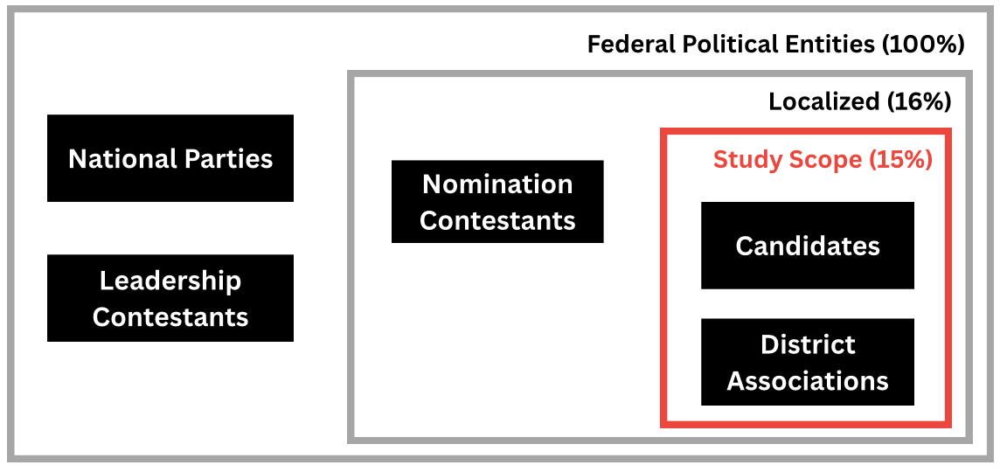
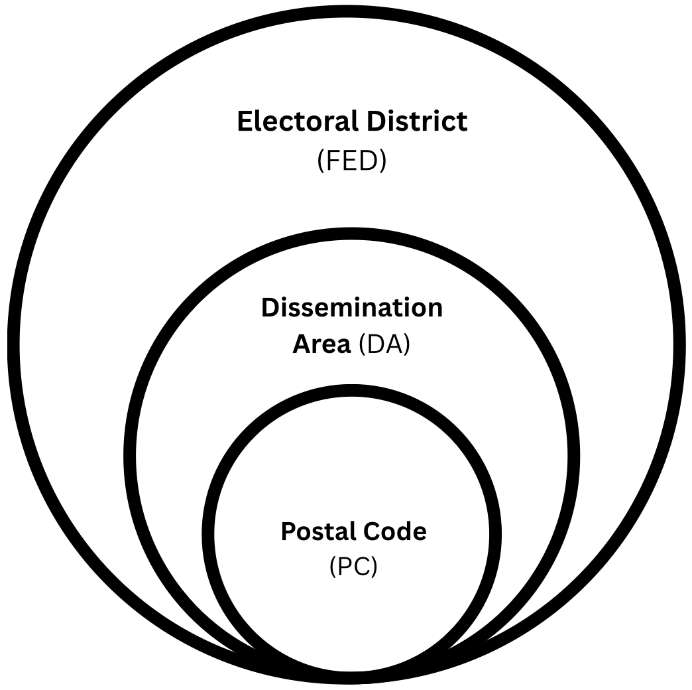
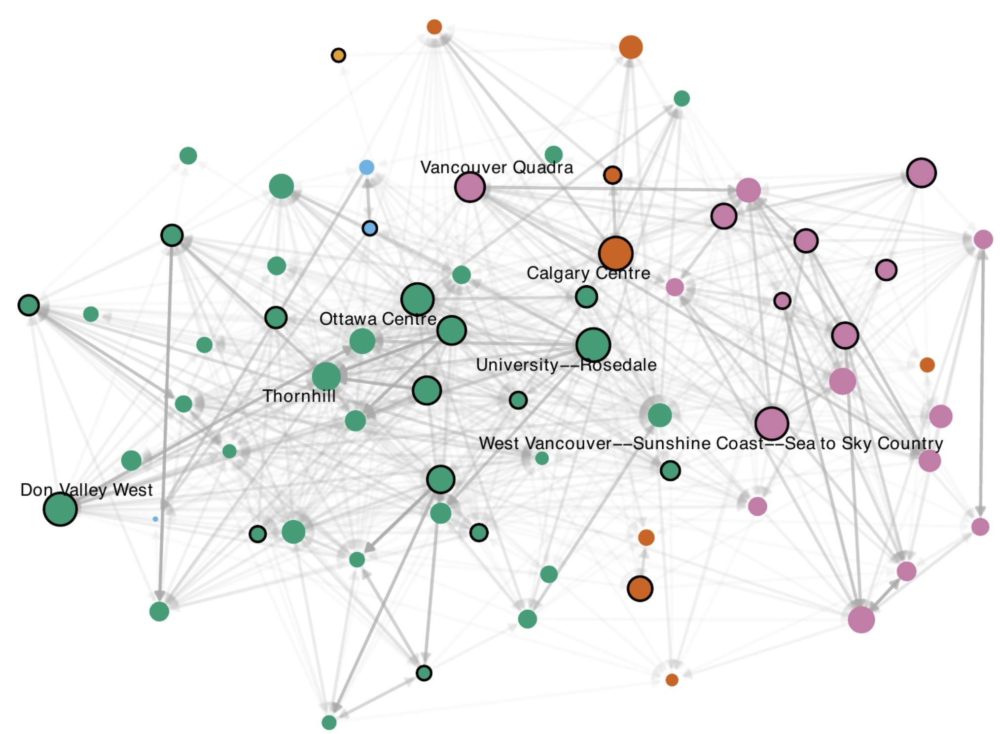
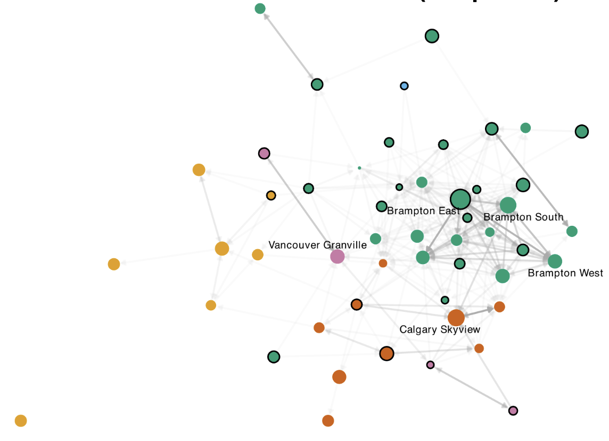
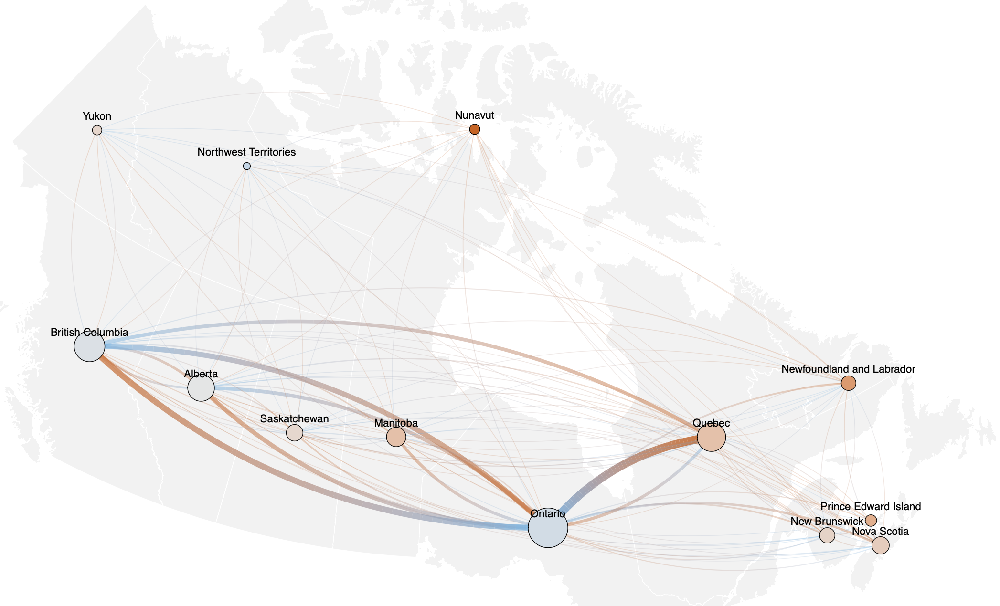
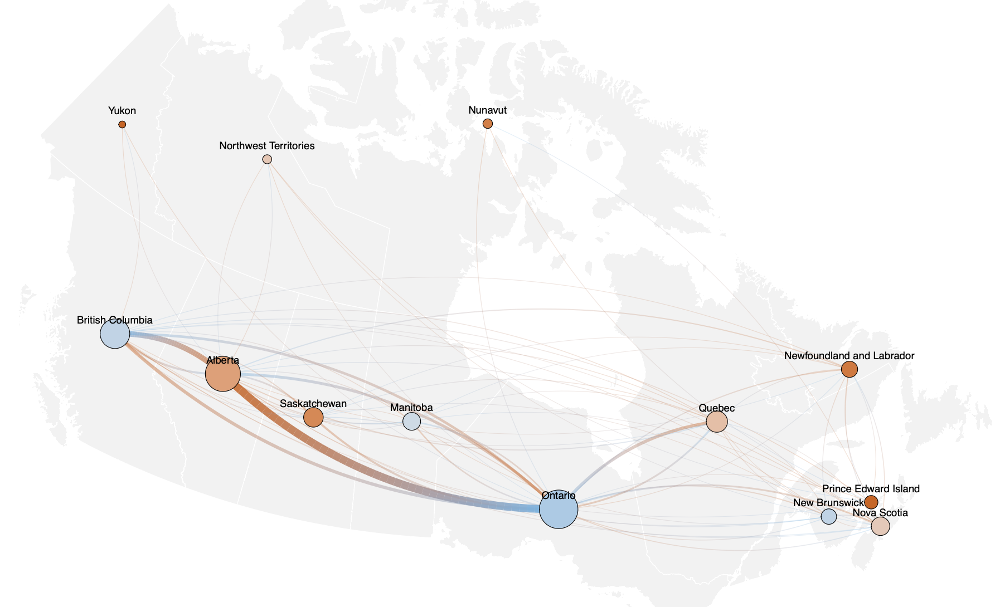

```{r}
#| include: false
library(tidyverse)
library(tinytable)
```

## Representation is Geographical {.smaller}

- <p style="text-align: justify;">In Canada, federal representation is structurally **geographical**: citizens are grouped into a few hundred **electoral districts** based on where they live, each represented by a single **Member of Parliament**.</p>

<div style="height: 15px;"></div>

- <p style="text-align: justify;">Yet many citizens seek representation **beyond their district's boundaries** [@mansbridge_rethinking_2003] — a form of "**surrogate**" representation, exercised primarily through **out-of-district donations** to political entities.</p>

## Why Study Donations? {.smaller}

- <p style="text-align: justify;">Donations are the **primary source of funding** for campaigns and district associations in North America [@gimpel_check_2008; @garnett_where_2024; @canada_understanding_2026], making them central to how political influence is distributed.</p>

<div style="height: 15px;"></div>

- <p style="text-align: justify;">Out-of-district giving is not always representationally motivated. Donors may act out of **ideological alignment**, **partisan loyalty**, or simply as a **favour** or to "fit in" socially [@gimpel_political_2006; @garnett_lifeblood_2022].</p>

## U.S. Research on Out-of-District Donation {.smaller}

- <p style="text-align: justify;">The U.S. shares Canada's geographic representational structure, and is where most North Amercan out-of-district donation research has been done.</p>
- <p style="text-align: justify;">Candidates there source **50–70%** of campaign funding from out-of-district, a share that has **risen sharply** this century [@gimpel_check_2008; @bednar_political_2011; @sievert_out_2023].</p>

<div style="height: 15px;"></div>

- <p style="text-align: justify;">This giving is thought to be **partisan-motivated** (more donations to close races), and largely originates from a small set of wealthy, educated, urban "**donor districts**" [@gimpel_political_2006; @gimpel_check_2008; @jacobs_nationalization_2024].</p>

## Donations in the Canadian Context {.smaller}

- <p style="text-align: justify;">Canadian donors tend to come from **older, wealthier, and better-educated** districts [@carmichael_political_2014; @garnett_where_2024], and often give to candidates they **share an identity with** — e.g. women to women [@tolley_who_2022], and high rates of **co-ethnic** giving, especially among South Asians [@besco_ethnic_2022].</p>

<div style="height: 15px;"></div>

- <p style="text-align: justify;">@garnett_lifeblood_2022 distinguish **political** (representational) from **transactional** (social) motivations — political giving dominates, especially among older, affluent donors, while transactional giving is more local.</p>

<div style="height: 15px;"></div>

- <p style="text-align: justify;">Unlike the U.S., party loyalty is **weak** (~2% are party members, vs. ~40% in the U.S.), favouring more ephemeral, identity- or policy-based loyalties [@garnett_lifeblood_2022; @carty_politics_2002; @usafacts_how_2026].</p>

## Our Contribution {.smaller}

- **Very little research exists on out-of-district donation in Canada.**
- @besco_ethnic_2022 found that out-of-district donation rates were higher among ethnic minorities (50-70%) compared to donors of European origin (33%). However, these proportions only describe candidate-bound donations, and only during the 2015 general election period.

<div style="height: 15px;"></div>

- More generally, **existing Canadian political donations research has focused almost exclusively on donations to candidates during election periods**.
- By considering (1) donations to **district associations** and (2) donations **outside election cycles**, we contribute a more holistic view of donation patterns and political financing.

## Primary Study Goals

1. <p style="text-align: justify;">To provide data summaries describing the prevalence of out-of-district donations throughout our study period.</p>
2. <p style="text-align: justify;">To describe the features of districts where donors have a higher propensity to give outside their district.</p>
3. <p style="text-align: justify;">To identify general patterns in the network of interdistrict funding formed by out-of-district donations.</p>


# Data Overview

## Open Data on Contributions {.smaller}

- <p style="text-align: justify;">The *Canada Elections Act* requires that all financial contributions to **federal political entities** over \$200 must have the donor's name and **location** recorded and shared with *Elections Canada*.</p>
- Since 2004, only **individuals** are permitted to contribute, subject to specific caps.

:::: {.columns}

::: {.column width="50%"}
- <p style="text-align: justify;"> We only considered contributions received by **district associations** and **electoral candidates**. We further restricted our analysis to contributions received during the 2013 representational order, effective between October 3, 2015 and April 22, 2024.</p>
:::

::: {.column width="50%"}
{width="100%"}
:::

::::

::: aside
Information on political financing and representational orders presented here is available on the [Elections Canada website](https://www.elections.ca/content.aspx?section=fin&document=index&lang=e).
:::

## Situating Donations in Space {.smaller}

- <p style="text-align: justify;">Donors were situated in space by matching their **postal codes** to **Census[^2] dissemination areas** (DAs), which were subsequently attributed to **electoral districts** (FEDs). Spatial assignments were made using a Postal Code Conversion File[^3] along with shapefiles for DAs and FEDs.</p>

:::: {.columns}

::: {.column width="60%"}
- <p style="text-align: justify;">Candidates and district assication districts were extracted directly from the contributions dataset introduced previously.</p>
- <p style="text-align: justify;">**Together, these steps allowed us to identify out-of-district donations, and calculate roughly how far they travelled.**</p>
:::

::: {.column width="40%"}
{width="75%" fig-align="center"}
:::

::::

[^2]: We chose the dissemination areas of the 2021 Census (see next slide).
[^3]: Postal codes, DAs, and electoral districts do not form a strict spatial hierarchy. Cases where a postal code straddled mutiple DAs, or where a DA straddled multiple districts were statistically resolved with the aim of minimizing individual geolocation errors.

## Augmenting with Census Information {.smaller}

- Once resolved, donor dissemination areas were augmented with socio-demographic characteristics (e.g. age, income, visible minority proportion, etc.) from the 2021 Canadian Census. The full data pipeline is illustrated below:

{width="100%" fig-align="center"}


# Data Summaries

- <p style="text-align: justify;">We start by situating individual local contributions (both in and out-of-district) in time, and among federal donations in general.</p>

## Donations to All Entities {.smaller}

- Contributions to **local entities[^1]** make up nearly half of all donations during general election periods, but only ~ 10% of  donations otherwise.
- Donations to candidates were restricted to election cycles, while district associations received donations throughout our study period.

```{r}
#| warning: false
#| message: false
#| echo: false
#| fig-width: 7
#| fig-height: 3.5
readRDS(here::here("other/figures/Figure_2_1.rds"))
```

[^1]: "Local entities" refers to candidates and district associations. Nomination contestants are also tied to electoral districts, however they are excluded from our study, and therefore also from this label.

## Donations to All Entities {.smaller}

- <p style="text-align: justify;">The bulk of all contributions (86%) are received outside of general election periods, with noticeable increases in donation rates during Conservative leadership contests.</p>
- <p style="text-align: justify;">Overall contribution rates increase throughout our study period, continuing the trend observed by @mcmahon_follow_2015 from 2004 to 2015.</p>

```{r}
#| warning: false
#| message: false
#| echo: false
#| fig-width: 7
#| fig-height: 3.5
readRDS(here::here("other/figures/Figure_2_2_v2.rds"))
```

## Donations to Local Entities {.smaller}

- <p style="text-align: justify;">**In-district** donations make up only 55% of the total contributed amount during our study period. Spikes in contribution rates during general election periods was the only major longitudinal trend we detected[^1].</p>

```{r}
#| warning: false
#| message: false
#| echo: false
#| fig-width: 8
#| fig-height: 4
readRDS(here::here("other/figures/Figure_2_4_v2.rds"))
```

[^1]: This held true even when donations to nomination contestants were considered.

## Donations to Local Entities {.smaller}

- <p style="text-align: justify;">**Out-of-district** donations are distributed similarly to in-district donations, both during and outside election periods, and accross (major) parties and entities. In each case, **between 30% and 50%** of donor-sourced funding received by local entities originated from out-of-district.</p>
- <p style="text-align: justify;">Unlike in the U.S., shares of out-of-district funding **do not** seem to increase over time.</p>
```{r}
#| warning: false
#| message: false
#| echo: false
#| fig-width: 8
#| fig-height: 4
readRDS(here::here("other/figures/Figure_2_5_v2.rds"))
```


# Data Summaries

- <p style="text-align: justify;">We then explored how the propensity for out-of-district donation varied from district to district.</p>

## District Level Means {.smaller}

- The constituents of the average district send around **40%** of their total contributions to non-local candidates and EDAs.
- Equivalently, the candidates and district associations of the average district receive around **40%** of their funding from their total contributions to other districts.
- This proportion was relatively constant both during and outside election periods, and accross (major) parties and entities, expectedly mirroring the proportions observed at the individual level.

<div style="height: 15px;"></div>

-  **However, we observed considerable variation in this proportion from district to district, both during and outside of election cycles.**

## Truly Out-of-District Donors {.smaller}

- Outside of election cycles, the constituents of some districts (e.g. Toronto St. Paul) consistently sent up to 80% of their funding to district associations outside their district.
- Donations to district associations during election cycles followed similar patterns.

```{r}
readRDS(here::here("other/figures/Figure_3_4_v1.rds"))
```

## Truly Out-of-District Donors {.smaller}

- Within election cycles, out-of-district donation rates are noticeably smaller, indicating more localized interest (or, more localized campaigning).

```{r}
readRDS(here::here("other/figures/Figure_3_4_v2.rds"))
```

## Truly Out-of-District Donors {.smaller}

- **These observed rates of out-of-district donation were compared against a null model that captures the effect of geography alone.**
- The model holds the observed distribution of donation distances fixed but randomizes each donation's direction. The model then reclassifies it as in or out-of-district using actual district boundaries. From this, we get the out-of-district rate expected purely from the spatial arrangement of districts.
- **Observed rates in most districts either fall short of, or far exceed purely distance-based expectations**, demonstrating that out-of-district donation rates vary beyond what would be reasonably expected from the spatial arrangement of districts alone.

## Modelling Out-of-District Propensity {.smaller}

- Given the observed variation in out-of-district giving unexplained by spatial heterogeneity,  **we fit a statistical model to characterize what features of a district are associated with higher rates of out-of-district donation.**

$$
\begin{aligned}
\text{logit}(p_i) &= \beta_0
  + \beta_1 \sqrt{\text{Density}_i}
  + \beta_2 \text{Age}_i \\
  &\quad + \beta_3 \log(\text{Income}_i)
  + \beta_4 \log(\text{Amount}_i) \\
  &\quad + \beta_5 \text{logit}(\text{VisMin}_i)
  + \beta_6 \text{logit}(\text{PostSec}_i)
  + \epsilon_i
\end{aligned}
$$

- where $p_i$ is the share of contributions sent out-of-district by district $i$.

- Variables were chosen based on (1) prior work by @garnett_where_2024, @gimpel_check_2008, and @besco_ethnic_2022. 
- Population density is included partly to control for the spatial clustering effect mentioned previously.

## Modelling Out-of-District Propensity {.smaller}

- As expected, most fitted coefficients were positive, all with high significance.
- While out-of-district donations in the U.S. are more common in predominantly white districts, this trend was not observed in the Canadian context.[^1]
- This finding is consistent with the individual-based results of @besco_ethnic_2022.

```{r}
#| warning: false
#| message: false
#| echo: false
FED_model <- readRDS(here::here("other/fitted_models/full_FED_model_base.rds"))

coef_tbl <- summary(FED_model)$coefficients

term_labels <- c(
  "(Intercept)" = "Intercept",
  "sqrt(FED_model_data$density_per_sqkm)" = "Population density (square root)",
  "FED_model_data$avg_age" = "Average age",
  "log(FED_model_data$median_hh_income)" = "Median household income (log)",
  "log(FED_model_data$total_amount)" = "Total amount donated (log)",
  "log(FED_model_data$vismin_total/(1 - FED_model_data$vismin_total))" = "Visible minority proportion (logit)",
  "log(FED_model_data$postsec_prop/(1 - FED_model_data$postsec_prop))" = "Post-secondary proportion (logit)"
)

format_p <- function(p) {
  ifelse(
    p < 2e-16,
    "<2e-16",
    formatC(p, format = "g", digits = 3)
  )
}

model_results <- tibble(
  Term = term_labels[rownames(coef_tbl)],
  Coefficient = formatC(coef_tbl[, "Estimate"], format = "f", digits = 3),
  `Std. Error` = formatC(coef_tbl[, "Std. Error"], format = "f", digits = 3),
  `t-statistic` = formatC(coef_tbl[, "t value"], format = "f", digits = 2),
  `p-value` = format_p(coef_tbl[, "Pr(>|t|)"])
)

tinytable::tt(model_results, width = 1) %>%
  format_tt(j = 1, escape = FALSE) %>%
  format_tt(j = 2:5, escape = TRUE) %>%
  style_tt(j = 1, align = "l") %>%
  style_tt(j = 2:5, align = "r") %>%
  style_tt(i = 0:nrow(model_results), fontsize = 0.6)
```

[^1]: This was observed even when the Brampton districts were removed, which had high leverage in the model. Visible minority proportion was also the greatest sole predictor of out-of-district propensity.


# Data Summaries

- <p style="text-align: justify;">Finally, we investigated patterns in the network of interdistrict funding formed by out-of-district donations.</p>

## Senders and Receivers {.smaller}

- **The amount sent to vs. the amount received by district associations was not equivalent for districts receiving and sending large sums**.
- Outside of election periods, districts fall cleanly into two groups: net-senders or net-receivers.

```{r}
readRDS(here::here("other/figures/Figure_3_3_v1.rds"))
```

## Senders and Receivers {.smaller}

- During elections, donations to candidates also separate into these groups at the district level, however it is less clear for big donor districts. For example, Brampton East is both among the top three sending and receiving districts.
- This provides some evidence for the existence of "donor districts" described in American literature. However, sending districts are **out-of-district donations (and donations in general) are more evenly distributed in space in Canada than in the U.S.**

```{r}
readRDS(here::here("other/figures/Figure_3_3_v2.rds"))
```

## Donations are Spatially Contstrained {.smaller}

- Outside of election periods, **over 50%** of out-of-district donations addressed to district associations are sent to associatons in adjascent districts. Only around 15% even leave their donor's province.



## Donations are Spatially Contstrained {.smaller}

- During election periods, donations to candidates and district associations are similarly localized, and even less likely to be sent out-of-province (10%).



## Interprovincial Fluxes {.smaller}

- Although out-of-district donations are largely compartmentalized within their provinces, **we also documented inter-provincial flow patterns.**

:::: {.columns}
::: {.column width="40%"}
- With the excpetion of Québéc, **flows from one province to another are roughly reciprocated.**
- Ontario and British Columbia are net-donor provinces, while other provinces tend to receive more donations than they give.
:::

::: {.column width="60%"}
{width="100%" fig-align="center"}
:::
::::

## Interprovincial Fluxes {.smaller}

- These patterns drastically change during election cycles[^1]. Donations to candidates and district associations are dominated by completely different links.

:::: {.columns}
::: {.column width="40%"}
- Ontario and British Columbia remain the primary net-givers, however their contributions target the prairies.
- These patterns may be explained by partisan differences between the three provinces.
- Notably, these fluxes are not reciprocated to the same extent.
:::

::: {.column width="60%"}
{width="100%" fig-align="center"}
:::
::::

[^1]: Individual election cycles exhibited similar patterns to the aggregated fluxes presented here.

# Discussion

## Main Takeaways {.smaller}

- Out-of-district donation is a consistent ...

- Despite it's consistentency through time (e.g. recipient party affilation), rates of out-of-district donation differ greatly, and somewhat predictably in space.

- Out-of-district donation patterns at the district level are qualitatively different when considering donations out of election cycles and within election cycles, accross an entire decade. This emphasizes the need for future research on Canadian donations to

## Some Notable Limitations {.smaller}

1. <p style="text-align: justify;">24% of the total amount contributed to local entities during our study period was donor-anonymized, and therefore could not be accounted for in our analyses.</p>
- However, a comparison of marginal ... showed that ...

```{r}
readRDS(here::here("other/appendix_figures/distribution_comparison_aggregated.rds"))
```

2. <p style="text-align: justify;">Our focus on out-of-district contributions meant excluding contributions addressed to national entities (parties and leadership contestants). As shown previously, contributions of this type represented a large majority (86%) of total contributions during our study period. This limits the generalizability of our study: the average Canadian donation cannot be conidered out-of-district or in-district.</p>

3. <p style="text-align: justify;">Our chosen study period awkwardly truncates the available data in the middle of the period between the 44th and 45th general elections. This was done in an attempt to restrict our analysis to a single, static set of electoral districts (FEDs). While we succeeded in excluding non-2013-order FEDs, we cannot guarantee that all valid 2013-order FED entries were captured, since the adoption of new FEDs is a multi-year project and timelines can differ drastically between locations.</p>

## References
