```{r}
#| include: false
#| warning: false
#| message: false

# # Data Loading & Manipulation
# library(tidyverse)
# library(arrow)
# library(here)
# library(sf)

# # Visualization Tools
# library(patchwork)
# library(modelsummary)
# library(tinytable)
# library(png)
# library(mgcv)

# # Analysis
# library(betareg)

# # Load in Supplimentary R Script
# source(here::here("paper/paper_helpers.R"))
# #    - FED_model_data
# #    - individual_model_data
# #    - redistribute_december_ma
# #    - donations_data_appendix
# #    - census_lookup
# #    - localized_donations_data

# # Load in Main Study Dataset (rest are loaded when `paper_helpers.R` is sourced)
# donations_data <- read_parquet(here::here("data/processed_data/donations_data.parquet"))

# # Load in Additional Simulation Datasets
# distance_hyp_test_results <- read_parquet(here::here("data/other/distance_hyp_test_results.parquet"))
# localized_donations_data_distances <- read_parquet(here::here("data/other/localized_donations_data_distances.parquet"))
# localized_donations_data_neighbours <- read_parquet(here::here("data/other/localized_donations_data_neighbours.parquet"))
```

## Federal Representation & Donations

::: {.notes}
- Citizens are grouped into spatially-defined districts, who vote to elect a single politician to represent them in parliament.
- Versatile: unconstrained in space and time; multiple entities (list); subject to limitations.
- Impactful: in Canada and the U.S. donations are the primary source of campaign funding, national party financing.
- Blue: Define OOD donation: when a donor contributes to some political entity outside their district.
- END: ... and are the primary means of doing so.
:::

- In many parliamentary democracies, citizens are represented at the federal level based on **where they live**[^1].

. . .

- While voting is the most direct form of individual political participation, **political donations** are a **versatile** and **impactful** alternative.

. . .

- **<span style="color: #4169E1;">Out-of-district donations</span> enable individuals to extend their political influence beyond their own district**.

[^1]: Many sovereign nations model federal representation in this way, including Canada, the United States, the United Kingdom, Australia, and New Zealand.

## Out-of-district Donations in the U.S.
::: {.notes}
- START 1: American patterns of out-of-district donation are **well-documented** throughout the 21st century.   
- Campaign funding: to congressional and senatorial candidates, regardless of party affiliation.
- COMMA: Rates have increased over the 21st century.
- "donor districts": a small set of districts situated in older, wealthier, white, well-educated, and affluent regions of America.
- GIMPEL: For example, donations more often to close races.
- START 3: impact the representational structure.
- END 3: ... as representatives become influenced by their national donor base.
:::

- **Two-thirds** of campaign funding is sourced from out-of-district, largely from a group of so-called **"donor districts"**.

. . . 

- Studies suggest that many of these donors are motivated by **partisan gain**[^2].

. . .

- Out-of-district donations **distort the relationship** between a representative and their constituents[^3].

[^2]: [@gimpel_check_2008]
[^3]: [@baker_getting_2016; @canes_wrone_out_2022; @nathan_donor_2025]

## Our Research Process {.center}

::: {.notes}
- START: We present our findings in three stages.
:::

. . .

1. **Document** the extent of out-of-district donation in a non-American context.

. . .

2. **Identify** shared attributes of locations where out-of-district donations more or less likely.

. . .

3. **Characterize** the network of localized political financing formed by out-of-district donations.

# Dataset

::: {.notes}
- START: I first explain how we constructed the dataset used in this study.
:::

## Open Data on Contributions

::: {.notes}
- Spatial: use donor postal codes to situate them within their districts.
- Census: socio-demographic characteristics of the donor's environment, such as income, or population density.
- END: these entites were chosen beause they are localized; donations to national parties cannot be assessed as in- or out-of-district. 
:::

- Database of all federal political donations above \$20, maintained by *Elections Canada*. Augmented with **spatial** and **Census** data from *Statistics Canada*.

. . .

- Analysis restricted to:
    - Donations above \$200 (loction-disclosed)
    - Donations sent from October 2015 to April 2024
    - Donations addressed to candidates[^4] or district associations

[^4]: Only candidates running during general elections were considered. By-electoral candidates were not included in this analysis.

----

::: {.notes}
- Three stages; acquisition, cleaning, consolidation.
:::

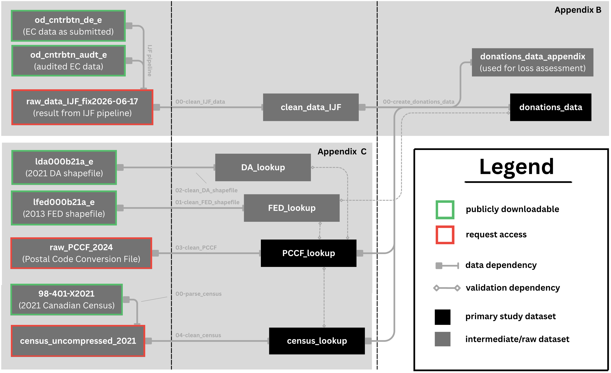


# Results

Spatio-temporal trends in out-of-district donations rates.

## Trends in Out-of-district Donations

::: {.notes}
- END 1: ... increasing to 40% and 48% when weighted by amount.
:::

- 38% and 44% of all donations to candidates and district associations came from out-of-district.

. . .

- Rates were relatively constant through time and across political parties.

. . .

- **However, out-of-district donation rates were very different from district to district.**

---

::: {.notes}
- FIGURE: Rates accross all 3 general elections were similar.
:::

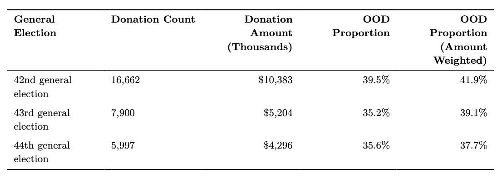

--- 

::: {.notes}
- FIGURE: Similarly, district association rates at any point in time was similar to the overall rate. 
:::

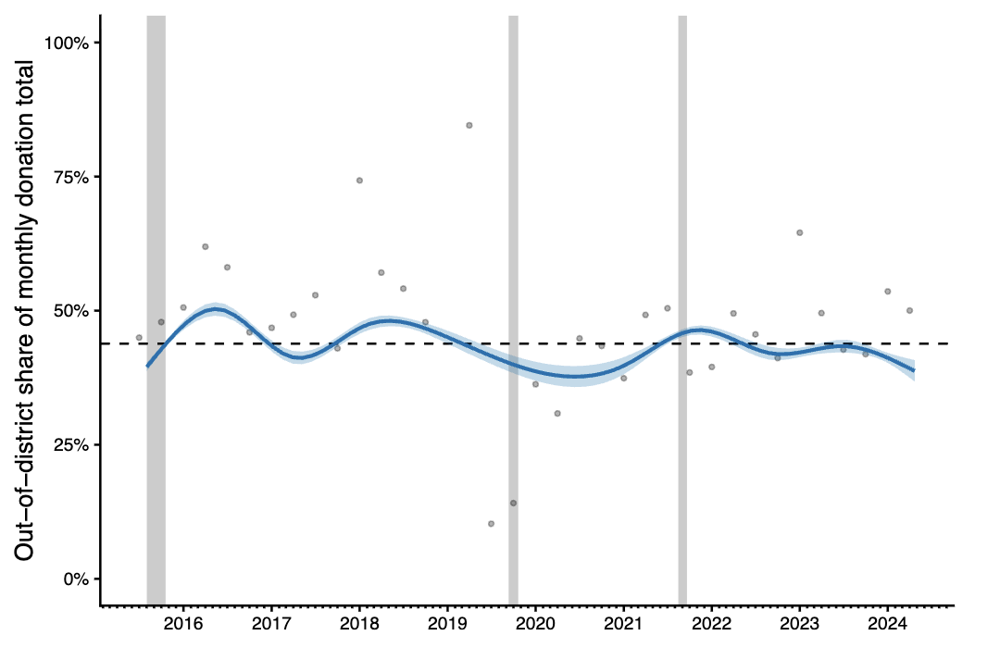

----

::: {.notes}
- FIGURE: When stratifying by district, we observe large variance in out-of-district propensity.
:::

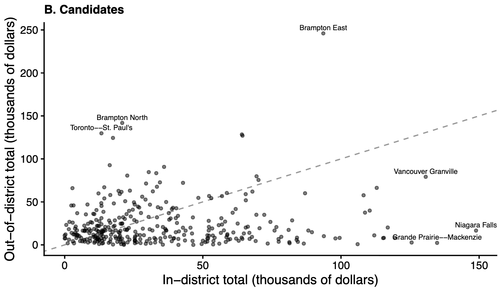

----

::: {.notes}
- FIGURE: This variance is similarly observed in district associations.
:::

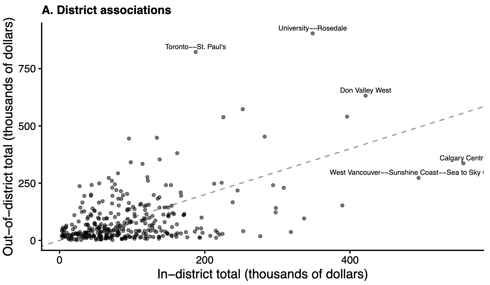

----

::: {.notes}
FIGURE: Simulations showed that observed district-level rates, and the overall spatial variability in out-of-district donor propensity disagreed with what would have been expected from the spatial arrangement of districts alone. For example we might expect that smaller, downtown Toronto districts send more simply ...
:::

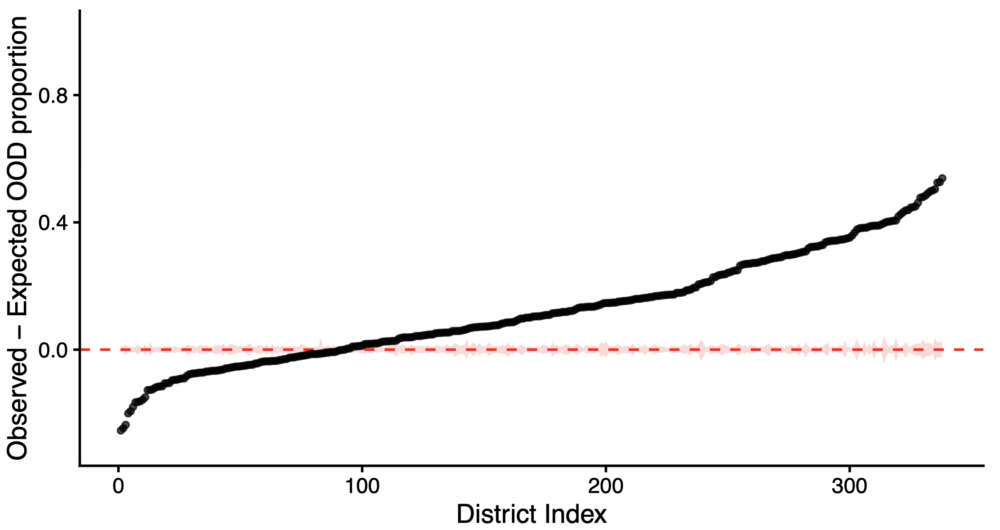


# Results

Modelling out-of-district propensity

## Modelling Out-of-district Propensity

::: {.notes}
- We fit two regression models.
- FIRST: To better understand what makes donations more or less likely to leave their donor's district, ...
- DISCUSS THE PREDICTORS AND WHY THEY WERE CHOSEN.
- Square root of population density ~ inverse measure of the average distance between people.
:::

1.  We used **logistic regression** to model whether or not an individual donation was sent out-of-district. 

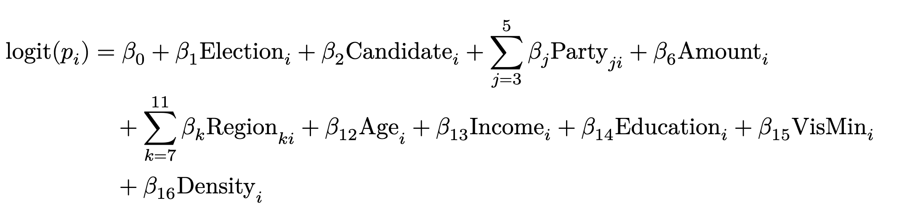

## Modelling Out-of-district Propensity

::: {.notes}
- SECOND: To better explain the observed variance in rates accross districts, ...
- Model results were similar when the proportion of donations was modelled instead of the share of amount donated.
:::

2.  We used **beta regression** to model the share of donor-based funding that left a given district.

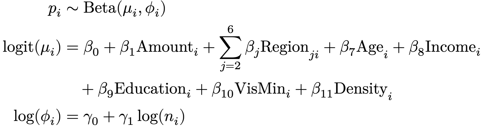

----

::: {.notes}
- Key findings are the positive association of socio-demographic characteristics except age.
- We note that there is high multicollinearity between these factors, .
- Findings were similar when donations to candidates and district associations were modelled seperartely.
:::

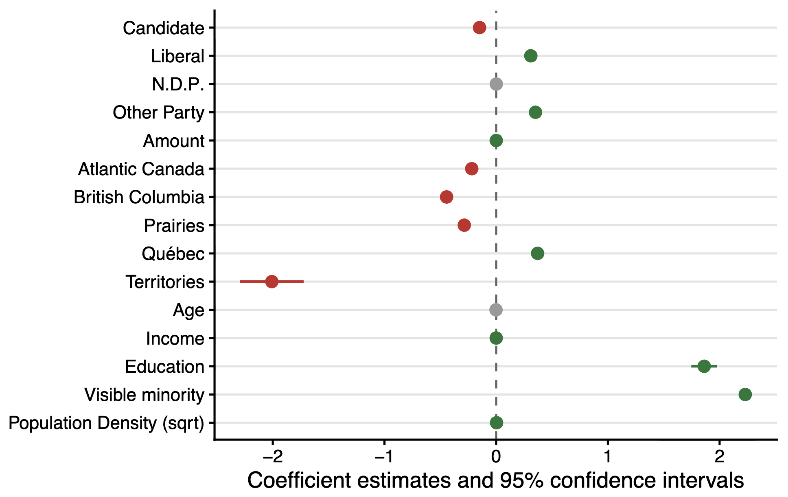

----

::: {.notes}
- District-level findings are largelty identical.
- We again see a positive effect of these socio-demographic characeristics.
- Models with only region and amount did not perform well. 
- Models with population density alone explained half of the variance, but characteristics helped push the model's explainability to around 70%.
:::

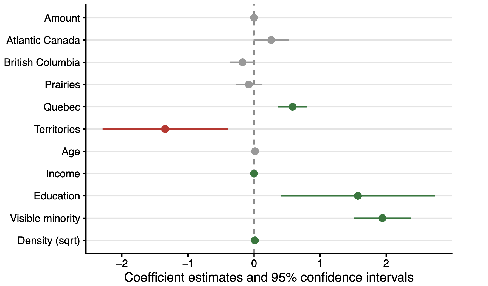

# Results

::: {.notes}
Finally, we briefly characterize the network of interdistrict funding formed by out-of-district donations.
:::

Characterizing the network of out-of-district donations

## Interdistrict Local Funding Network

::: {.notes}
Important = garnered or produced the largest amount of donations.
:::


- Only 50% of out-of-district donations left their immediate neighborhood.

. . .

- Only 13% of out-of-district donations (9% for candidates, 14% for district associations) left their province.

. . .

- Most important districts could be classified as **senders** or **receivers** of out-of-district donation.

----

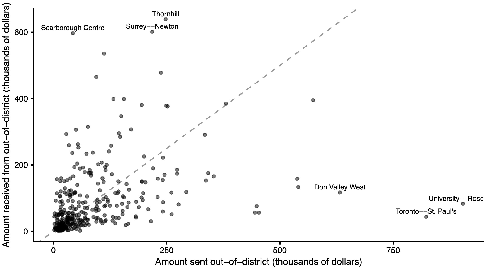

# Conclusion

## Key Takeaways

::: {.notes}
TWO: Donations from districts with higher-income, better-educated, more densely populated districts with a higher visible minority proportion are more likey to be received somewhere else.
END: ... limiting the spatial extent of their potential political influence.
:::


1. Out-of-district donations are a **substantive** and **persistent** feature of the Canadian localized political financing landscape.

. . .

2. Out-of-district donation rates vary more from district-to-district than what their spartial arrangement alone can explain.

. . .

3. Despite their prevalence, out-of-district donations remain largely bound by provincial lines.

# Thank you for your attention!


## References